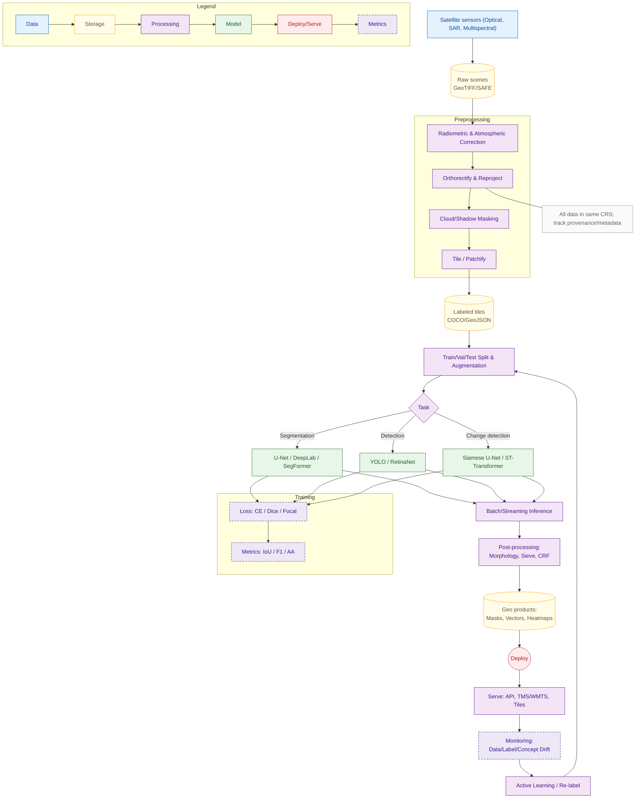

- **Project A:** one-line summary and link
- **Project B:** one-line summary and link

```mermaid
flowchart TB
  %% ---------- Styles ----------
  classDef data   fill:#e3f2fd,stroke:#1565c0,color:#0d47a1
  classDef store  fill:#fffde7,stroke:#f9a825,color:#6d4c41
  classDef proc   fill:#f3e5f5,stroke:#6a1b9a,color:#4a148c
  classDef model  fill:#e8f5e9,stroke:#2e7d32,color:#1b5e20
  classDef deploy fill:#ffebee,stroke:#c62828,color:#b71c1c
  classDef metric fill:#ede7f6,stroke:#4527a0,color:#311b92,stroke-dasharray: 5 3
  classDef note   fill:#fafafa,stroke:#9e9e9e,color:#616161

  %% ---------- Legend ----------
  subgraph Legend
    direction LR
    L1["Data"]:::data --> L2["Storage"]:::store --> L3["Processing"]:::proc --> L4["Model"]:::model --> L5["Deploy/Serve"]:::deploy --> L6["Metrics"]:::metric
  end

  %% ---------- Pipeline ----------
  A1["Satellite sensors (Optical, SAR, Multispectral)"]:::data --> A2[("Raw scenes\nGeoTIFF/SAFE")]:::store

  subgraph Preprocessing
    direction LR
    P1["Radiometric & Atmospheric Correction"]:::proc --> P2["Orthorectify & Reproject"]:::proc --> P3["Cloud/Shadow Masking"]:::proc --> P4["Tile / Patchify"]:::proc
  end
  A2 --> P1

  P4 --> A3[("Labeled tiles\nCOCO/GeoJSON")]:::store
  A3 --> P5["Train/Val/Test Split & Augmentation"]:::proc

  %% Task selection
  T{"Task"}:::proc -->|Segmentation| Mseg["U-Net / DeepLab / SegFormer"]:::model
  T -->|Detection| Mdet["YOLO / RetinaNet"]:::model
  T -->|Change detection| Mchg["Siamese U-Net / ST-Transformer"]:::model
  P5 --> T

  %% Training loop
  subgraph Training
    direction LR
    L1a["Loss: CE / Dice / Focal"]:::metric --> L2a["Metrics: IoU / F1 / AA"]:::metric
  end
  Mseg --> L1a
  Mdet --> L1a
  Mchg --> L1a

  %% Inference + Post
  I1["Batch/Streaming Inference"]:::proc --> I2["Post-processing:\nMorphology, Sieve, CRF"]:::proc --> I3[("Geo products:\nMasks, Vectors, Heatmaps")]:::store

  Mseg --> I1
  Mdet --> I1
  Mchg --> I1

  %% Serving / Deployment
  I3 --> D1(("Deploy")):::deploy
  D1 --> D2["Serve: API, TMS/WMTS, Tiles"]:::proc

  %% Monitoring & Feedback
  D2 --> Mon["Monitoring:\nData/Label/Concept Drift"]:::metric --> Cur["Active Learning / Re-label"]:::proc --> P5

  %% Notes
  N1["All data in same CRS; track provenance/metadata"]:::note
  P2 --- N1
```